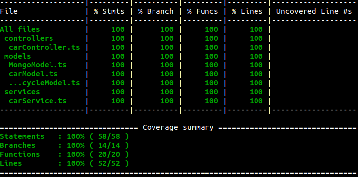

#  <h1 align="center">Projeto Backend - Car Shop API!</h1>

  

## O que foi desenvolvido

Desenvolvi uma API CRUD para gerenciar uma concessionária de veículos, aplicando os princípios de Programação Orientada a Objetos (POO), SOLID, TypeScript e Testes automatizados com Mocha Chai e Sinon. Utilizando o banco de dados MongoDB.

# Habilidades

Neste projeto, fui capaz de:

- Desenvolver uma aplicação em TypeScript tornando o desenvolvimento mais seguro.

- Utilizar conceitos de POO(Programação Orientada a Objetos) e SOLID.

- Utilizar o Framework Express.

- Desenvolver uma API RESTful utilizando a arquitetura de software MSC(Model-Service-Controller).

- Criar um banco de dados utilizando a ODM Moogoose.

- Utilizar a lib ZOD para validação de requisições.

## 🛠 Tecnologias

As seguintes ferramentas foram usadas na construção do projeto:

- [TypeScript](https://www.typescriptlang.org/)
- [Nodejs](https://nodejs.org/en/)
- [Express](https://expressjs.com/)
- [Json Web Tokens](https://jwt.io/)
- [Zod](https://zod.dev/)
- [MongoDb](https://www.mongodb.com/)
- [Mocha]()
- [Chai]()
- [Sinon]()
- [Docker]()
- [POO]()
- [SOLID]()

## Aplicação com 100% de Cobertura de Testes

  

## Instruções para abrir a aplicação
Para rodar está aplicação é necessário ter Git, Docker, Node e o Docker Compose instalados. Docker Compose na versão 1.29 ou superior e o Node na versão 16.

1. Clone o repositório
  * `git clone git@github.com:ramondfalcao/project-car-shop-api.git`
  * Entre na pasta do repositório que você acabou de clonar:
    * `cd project-car-shop-api`

2. Execute os containers Docker
    * `npm run compose:up`
